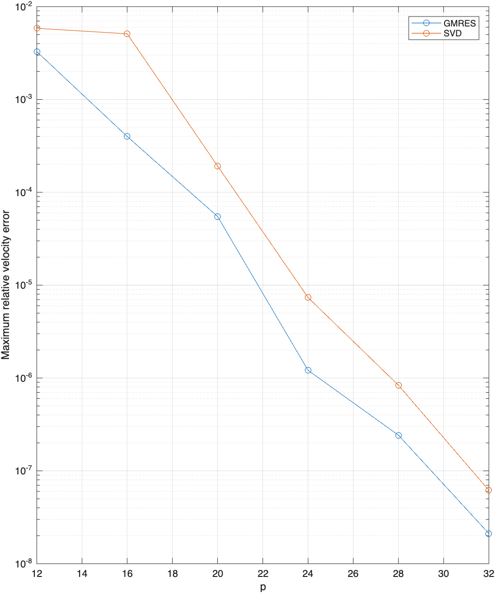
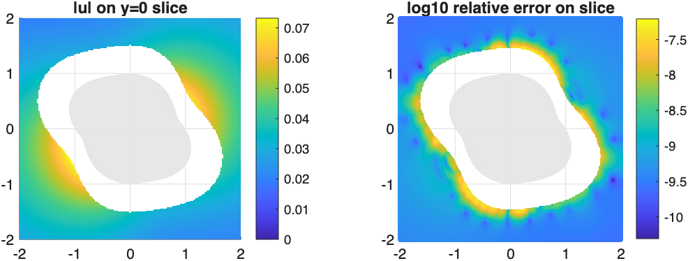
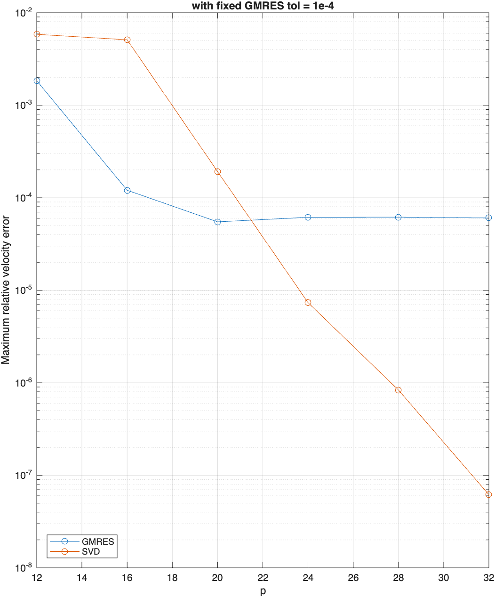

# Stokes nullspace convergence

Results from [`test_stokes_nullspace.m`](test_stokes_nullspace.m) for the `Y43` surface, using an interior point force as the reference solution for the mixed boundary conditions. Here `p` is the spherical-harmonic degree, with `N = 2*p*(p+1)` surface nodes.

For the first table, GMRES used the normal rank-one correction and coordinate preconditioner `L`, with tolerances `[1e-2, 1e-3, 1e-4, 1e-5, 1e-6, 1e-7]`. The SVD solve used the original mixed matrix with an absolute singular-value cutoff of `1e-10`.

| p | SLP_null | traction_null | mixed_null | GMRES_error | SVD_error | GMRES_flag | iterations |
| ---: | ---: | ---: | ---: | ---: | ---: | ---: | ---: |
| 12 | 0.000121440195704938 | 0.000292654002438407 | 0.000269266421679574 | 0.00327942056992365 | 0.00584089183175952 | 0 | 16 |
| 16 | 3.371256363554e-05 | 9.55150585735985e-05 | 8.40476629363724e-05 | 0.000398989559409522 | 0.0050973535992488 | 0 | 23 |
| 20 | 8.07714257633616e-06 | 2.25976589488418e-05 | 2.04727793189859e-05 | 5.48770256509344e-05 | 0.000191853039944574 | 0 | 34 |
| 24 | 2.09753180248932e-06 | 5.82900107539282e-06 | 5.27348814028434e-06 | 1.21053160275257e-06 | 7.35919816754993e-06 | 0 | 44 |
| 28 | 6.28175282321912e-07 | 1.9889260637269e-06 | 1.86133616873756e-06 | 2.42194752477644e-07 | 8.35490468499124e-07 | 0 | 82 |
| 32 | 1.87249417221334e-07 | 6.09954577561461e-07 | 5.73406192776109e-07 | 2.11333342600752e-08 | 6.17374527304779e-08 | 0 | 137 |

<table>
<tr>
<td width="24%" valign="top"></td>
<td width="76%" valign="top"></td>
</tr>
</table>

With the same setup and a fixed GMRES tolerance `tol_list = [1e-4, 1e-4, 1e-4, 1e-4, 1e-4, 1e-4]`:

| p | SLP_null | traction_null | mixed_null | GMRES_error | SVD_error | GMRES_flag | iterations |
| ---: | ---: | ---: | ---: | ---: | ---: | ---: | ---: |
| 12 | 0.000121440195704938 | 0.000292654002438407 | 0.000269266421679574 | 0.00184305640675321 | 0.00584089183175952 | 0 | 67 |
| 16 | 3.371256363554e-05 | 9.55150585735985e-05 | 8.40476629363724e-05 | 0.000120610265460473 | 0.0050973535992488 | 0 | 43 |
| 20 | 8.07714257633616e-06 | 2.25976589488418e-05 | 2.04727793189859e-05 | 5.48770256509344e-05 | 0.000191853039944574 | 0 | 34 |
| 24 | 2.09753180248932e-06 | 5.82900107539282e-06 | 5.27348814028434e-06 | 6.14625264028823e-05 | 7.35919816754993e-06 | 0 | 32 |
| 28 | 6.28175282321912e-07 | 1.9889260637269e-06 | 1.86133616873756e-06 | 6.16673092626382e-05 | 8.35490468499124e-07 | 0 | 32 |
| 32 | 1.87249417221334e-07 | 6.09954577561461e-07 | 5.73406192776109e-07 | 6.04363231422386e-05 | 6.17374527304779e-08 | 0 | 32 |

